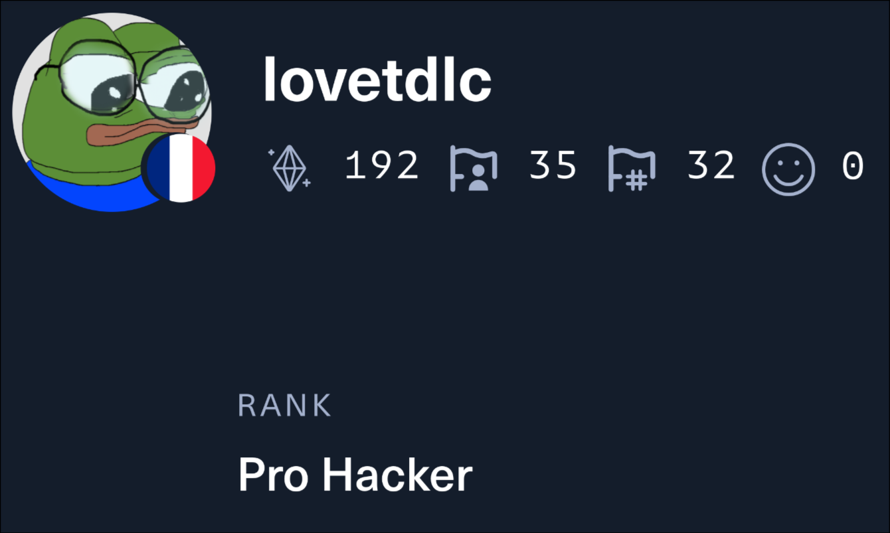

---
#
# By default, content added below the "---" mark will appear in the home page
# between the top bar and the list of recent posts.
# To change the home page layout, edit the _layouts/home.html file.
# See: https://jekyllrb.com/docs/themes/#overriding-theme-defaults
#
layout: home
---

<html>
  <head>
    <title>Pic</title>
  </head>
  
  <body>
    

      

        
      

      

        Currently working at <b>COGICEO</b> as a cybersecurity consultant, my expertise spans penetration testing, web infrastructure security and configuration audits, and I enjoy tackling complex technical challenges. I remain curious and open to new fields and technologies, constantly seeking opportunities to grow and push my skills further.
      

    

  </body>
</html>

 

  <a href="../files/CV Merle Jean-Charles.pdf" class="button" style="font-size: 20px; padding: 10px 20px;">Download my CV</a>

# Education

I hold a <b>Master’s degree in Cryptology and Computer Security</b> from the University of Bordeaux, along with a <b>Bachelor’s degree in Computer Science</b> completed in 2023. I also spent a year studying at Inha University in South Korea, an experience that broadened both my academic perspective and cultural horizons.
  
[**Coursework from my studies**](../courses/)

 

# Projects

Some of the projects that I worked on during my studies:
- Fuzzing of the TCP/IP Stack in [libslirp](https://gitlab.freedesktop.org/slirp/libslirp) using the LLVM libFuzzer
- Sudoku Solver and Generator in C with various heuristics and algorithms
- Implementation of the simple one-player puzzle game [Lightup](https://www.chiark.greenend.org.uk/~sgtatham/puzzles/js/lightup.html) in C making use of various tools such as SDL and Makefile  
  
[**More projects**](../projects/)

 

# Certifications

    

[CISCO CyberOps Associate](https://www.cisco.com/site/us/en/learn/training-certifications/certifications/cyberops/cyberops-associate/index.html#tabs-35d568e0ff-item-194f491212-tab): obtained in 2023 at Inha University, South Korea  

    

[CISCO DevNet Associate](https://www.cisco.com/site/us/en/learn/training-certifications/certifications/devnet/associate/index.html#tabs-35d568e0ff-item-194f491212-tab): obtained in 2023 at Inha University, South Korea

 

# Hobbies and Interests

In my free time, I enjoy working on challenges from **root-me.org** (**[profile](https://www.root-me.org/lovetdlc?lang=fr#cc278f2e5def6c08abfb11b28739cc1d)**), **TryHackMe** (**[profile](https://tryhackme.com/r/p/lovetdlc)**) and **HackTheBox** (**[profile](https://app.hackthebox.com/profile/1555292)**), which are platforms dedicated to cybersecurity and ethical hacking. It allows me to sharpen my skills in various areas such as web security, pentesting, reverse engineering, and app vulnerabilities.

<!-- ![Root-me-stats] (https://root-me-diff.vercel.app/rm-gh?nickname=lovetdlc&gstats=show&style=dark) -->

  

 

  

 

  

 

I also maintain a homelab server where I host various services to manage and secure my personal data:
- **Nextcloud**: for file synchronization and sharing
- **Vaultwarden**: for managing passwords securely
- **Immich**: for backing up and organizing photos
- **Plex**: for streaming multimedia content
- And some more...  
  
This server has helped me learn some skills about system administration, network configuration, and data security, as well as bettering my understanding of tools such as **Docker** and **Nginx Proxy Manager**.
